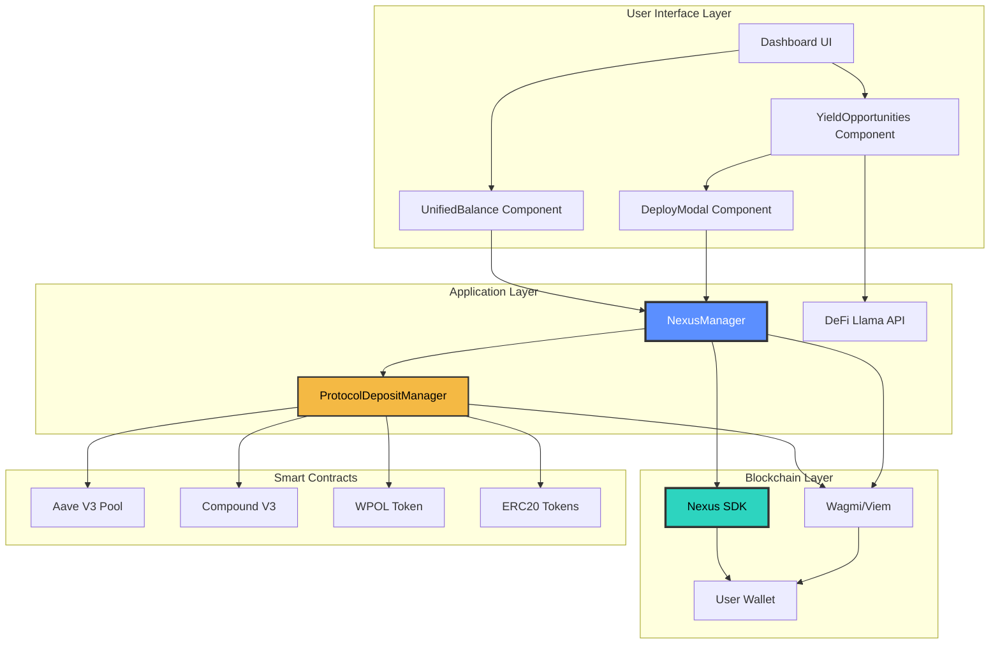

# FreeFI - Auto-Optimizing Cross-Chain Savings

## 🎯 One-Sentence Description

FreeFI automatically moves your USDC to the highest-yielding DeFi protocol across all chains, with gasless rebalancing and one-click deposits from anywhere.

Cross-Chain DeFi Yield Optimizer powered by Avail Nexus
The Problem
DeFi users lose money daily because:

## Deck

### Problem
Fragmented liquidity across 10+ chains
Manual yield hunting takes hours
High gas costs for rebalancing
Missed opportunities while you sleep

### The Solution
FreeFi automatically finds and deploys your assets to the highest-yield opportunities across all major chains in 10-15 seconds.
How It Works

Connect wallet → See unified balance across Ethereum, Arbitrum, Optimism, Base, Polygon, and more
View opportunities → Real-time APY comparison with risk scoring
One-click deploy → Avail Nexus handles cross-chain bridging + protocol deposits automatically

### Key Features

🌐 Unified Dashboard - Single view of all your assets across 10+ chains
📊 Smart Ranking - APY comparison with LOW/MED/HIGH risk scoring
⚡ 10-Second Bridging - Powered by Avail Nexus solver network
🎯 Auto-Optimization - Deploy to top protocols (Aave, Compound, Curve) instantly
💰 Supports USDC, USDT, ETH - Major stablecoins and blue chips

### Tech Stack

Frontend: Next.js 15, React 18, TypeScript, TailwindCSS
Web3: Wagmi v2, RainbowKit, Viem
Cross-Chain: Avail Nexus SDK (10+ chains, sub-15s bridging)
Data: DeFi Llama API for real-time yields

### Why Avail Nexus?

Traditional bridges: 7-30 minutes
Avail Nexus: 10-15 seconds ⚡
Unified liquidity layer across all major L2s
No wrapped tokens, native asset delivery

### Market Opportunity

$50B+ TVL across DeFi protocols
10M+ active DeFi users manually managing positions
Average user checks yields 2-3x per week
Opti automates what takes hours into seconds

### Nexus SDK Integration Details

This architecture demonstrates a production-ready cross-chain DeFi yield optimizer leveraging:

    ✅ Avail Nexus SDK for seamless cross-chain operations
    ✅ Atomic transactions via bridgeAndExecute
    ✅ Automatic token wrapping for native tokens
    ✅ Multi-protocol support (Aave, Compound)
    ✅ Real-time yield data from DeFi Llama
    ✅ Progressive enhancement with graceful fallbacks
    ✅ Type-safe implementation with TypeScript

