# FreeFi Protocol Architecture

## Complete System Flow with LayerZero & EVVM

This document explains the complete architecture including gasless deposits, cross-chain bridging, and LayerZero integration.

---

## 1. Gasless Deposit Flow (Sepolia)

```mermaid
sequenceDiagram
    participant User
    participant Frontend
    participant MetaMask
    participant Executor as Executor (Fisher)<br/>Fishing Spot API
    participant USDC as USDC Contract<br/>Sepolia
    participant Vault as VaultEVVM<br/>Sepolia
    participant EVVM as EVVM Contract<br/>(Optional)

    Note over User,Vault: Step 1: One-time USDC Approval (User Pays Gas)
    User->>Frontend: Enter amount (e.g., 100 USDC)
    Frontend->>Frontend: Check USDC allowance
    alt No allowance
        Frontend->>MetaMask: Request USDC approval
        MetaMask->>User: Sign approval tx
        User->>MetaMask: Approve
        MetaMask->>USDC: approve(vault, amount)
        USDC-->>Frontend: Approval confirmed ✅
    end

    Note over User,Vault: Step 2: Sign Message (FREE - No Gas!)
    Frontend->>Frontend: Get user nonce
    Frontend->>MetaMask: Request signature<br/>personal_sign(hash)
    Note right of MetaMask: Message Hash:<br/>keccak256(<br/>"VaultEVVM.depositGasless",<br/>user, amount, nonce,<br/>chainId, vaultAddress<br/>)
    MetaMask->>User: Sign message?
    User->>MetaMask: Sign (No gas!)
    MetaMask-->>Frontend: Return signature ✅

    Note over User,Vault: Step 3: Submit to Fishing Spot (FREE!)
    Frontend->>Executor: POST /api/executor<br/>{user, amount, nonce, signature}
    Note right of Executor: Fisher captures transaction

    Note over Executor,Vault: Step 4: Executor Pays Gas & Executes
    Executor->>Executor: Validate signature
    alt Using EVVM (Optional)
        Executor->>EVVM: executeWithAsyncNonce(<br/>vault, calldata, nonce)
        EVVM->>Vault: depositGasless(<br/>user, amount, nonce, signature)
    else Direct Call
        Executor->>Vault: depositGasless(<br/>user, amount, nonce, signature)
    end

    Vault->>Vault: Verify EIP-191 signature
    Vault->>Vault: Check nonce
    Vault->>USDC: transferFrom(user, vault, amount)
    USDC-->>Vault: Transfer success
    Vault->>Vault: Calculate shares<br/>Mint shares to user
    Vault->>Vault: Increment nonce
    Vault-->>Executor: Deposit complete ✅
    Executor-->>Frontend: Success + txHash
    Frontend-->>User: "You paid 0 gas!" 🎉

    Note over User,Vault: User Balance Updated
    Frontend->>Vault: Read userShares(user)
    Vault-->>Frontend: Return shares
    Frontend-->>User: Display new balance
```



---

## 2. Cross-Chain Withdrawal & Bridge Flow (Sepolia → Arbitrum)

```mermaid
sequenceDiagram
    participant User
    participant Frontend
    participant Vault as VaultEVVM<br/>Sepolia
    participant OFT_Sep as YieldFlowOFTEVVM<br/>Sepolia
    participant LZ_Sep as LayerZero Endpoint<br/>Sepolia
    participant LZ_Arb as LayerZero Endpoint<br/>Arbitrum Sepolia
    participant OFT_Arb as YieldFlowOFTEVVM<br/>Arbitrum Sepolia
    participant User_Arb as User Wallet<br/>Arbitrum

    Note over User,User_Arb: Gasless Withdrawal with Cross-Chain Bridge

    Note over User,Vault: Step 1: Sign Withdrawal Message (FREE)
    User->>Frontend: Request withdraw 100 USDC<br/>to Arbitrum
    Frontend->>Frontend: Get user nonce
    Frontend->>User: Sign withdrawal message
    Note right of User: Message Hash:<br/>keccak256(<br/>"VaultEVVM.withdrawGasless",<br/>user, shares, nonce,<br/>chainId, vaultAddress<br/>)
    User-->>Frontend: Signature ✅

    Note over Frontend,Vault: Step 2: Executor Withdraws & Bridges
    Frontend->>Executor: POST /api/executor/withdraw<br/>{user, shares, signature}

    Executor->>Vault: withdrawGasless(<br/>user, shares, nonce, signature)
    Vault->>Vault: Verify signature
    Vault->>Vault: Burn user shares
    Vault->>Vault: Calculate USDC amount<br/>Deduct 0.1% fee

    Note over Vault,OFT_Sep: Step 3: Deposit to OFT & Mint
    Vault->>OFT_Sep: depositAndMint(<br/>usdcAmount, user)
    OFT_Sep->>OFT_Sep: Mint OFT tokens to user

    Note over OFT_Sep,LZ_Arb: Step 4: LayerZero Cross-Chain Message
    Executor->>OFT_Sep: withdrawAndBridge(<br/>amount, dstEid=40231)
    OFT_Sep->>OFT_Sep: Burn OFT tokens
    OFT_Sep->>LZ_Sep: send(<br/>dstEid, recipient, amount)

    Note right of LZ_Sep: LayerZero<br/>Cross-Chain<br/>Message Relay

    LZ_Sep->>LZ_Arb: Cross-chain message<br/>via DVNs & Executors

    Note over LZ_Arb,User_Arb: Step 5: Receive on Arbitrum
    LZ_Arb->>OFT_Arb: lzReceive(message)
    OFT_Arb->>OFT_Arb: Mint OFT tokens
    OFT_Arb->>User_Arb: Transfer OFT to user

    OFT_Arb-->>Frontend: Bridge complete ✅
    Frontend-->>User: "Received on Arbitrum!" 🎉
```



---

## 3. Complete System Architecture

```mermaid
graph TB
    subgraph Frontend["Frontend (Next.js)"]
        UI[User Interface]
        Hooks[React Hooks<br/>useGaslessDeposit<br/>useVaultBalance]
        API[Executor API<br/>/api/executor]
    end

    subgraph Ethereum_Sepolia["Ethereum Sepolia"]
        USDC_Sep[USDC Mock<br/>ERC20]
        Vault[VaultEVVM<br/>Main Vault Contract]
        OFT_Sep[YieldFlowOFTEVVM<br/>Omnichain Fungible Token]
        LZ_Endpoint_Sep[LayerZero Endpoint<br/>Sepolia]
        EVVM_Sep[EVVM Contract<br/>Optional Gasless Layer]
        NameService[MATE NameService<br/>Identity System]
    end

    subgraph Arbitrum_Sepolia["Arbitrum Sepolia"]
        OFT_Arb[YieldFlowOFTEVVM<br/>Omnichain Fungible Token]
        LZ_Endpoint_Arb[LayerZero Endpoint<br/>Arbitrum]
        USDC_Arb[USDC<br/>Arbitrum]
    end

    subgraph LayerZero_Network["LayerZero Network"]
        DVN[Decentralized Verifier Networks]
        LZ_Executor[LayerZero Executors]
    end

    subgraph Executor_Service["Executor Service (Fisher)"]
        Fisher[Executor Wallet<br/>Pays Gas for Users]
    end

    %% User interactions
    UI -->|1. Approve USDC| USDC_Sep
    UI -->|2. Sign Message| Hooks
    Hooks -->|3. Submit Signature| API
    API -->|4. Execute depositGasless| Fisher

    %% Deposit flow
    Fisher -->|5. Call with signature| Vault
    Vault -->|6. transferFrom| USDC_Sep
    Vault -->|Gasless via| EVVM_Sep
    Vault -->|Resolve names| NameService

    %% Cross-chain bridge
    Vault -->|7. Mint OFT| OFT_Sep
    OFT_Sep -->|8. send(dstEid)| LZ_Endpoint_Sep
    LZ_Endpoint_Sep -->|9. Cross-chain msg| DVN
    DVN --> LZ_Executor
    LZ_Executor -->|10. Deliver| LZ_Endpoint_Arb
    LZ_Endpoint_Arb -->|11. lzReceive| OFT_Arb
    OFT_Arb -->|12. Mint & Transfer| USDC_Arb

    %% Styling
    classDef frontend fill:#5B8FFF,stroke:#fff,color:#fff
    classDef sepolia fill:#627EEA,stroke:#fff,color:#fff
    classDef arbitrum fill:#28A0F0,stroke:#fff,color:#fff
    classDef layerzero fill:#8B5CF6,stroke:#fff,color:#fff
    classDef executor fill:#10B981,stroke:#fff,color:#fff

    class UI,Hooks,API frontend
    class USDC_Sep,Vault,OFT_Sep,LZ_Endpoint_Sep,EVVM_Sep,NameService sepolia
    class OFT_Arb,LZ_Endpoint_Arb,USDC_Arb arbitrum
    class DVN,LZ_Executor layerzero
    class Fisher executor
```

---

## 4. Contract Interactions Detail


---

## 5. Gasless Transaction Validation

```mermaid
flowchart TD
    Start([User Signs Message]) --> Sign[Generate EIP-191 Signature]
    Sign --> Submit[Submit to Executor API]
    Submit --> Exec[Executor Receives Request]

    Exec --> Call[Call depositGasless with signature]
    Call --> Contract[VaultEVVM Contract]

    Contract --> Hash[Reconstruct Message Hash:<br/>keccak256 + EIP-191 prefix]
    Hash --> Recover[Recover Signer from Signature]
    Recover --> ValidSig{Signer == User?}

    ValidSig -->|No| Revert[❌ Revert: InvalidSignature]
    ValidSig -->|Yes| CheckNonce{Nonce Valid?}

    CheckNonce -->|No| RevertNonce[❌ Revert: InvalidNonce]
    CheckNonce -->|Yes| CheckBalance{User has USDC?}

    CheckBalance -->|No| RevertBalance[❌ Revert: InsufficientBalance]
    CheckBalance -->|Yes| Execute[✅ Execute Deposit]

    Execute --> Transfer[Transfer USDC from User]
    Transfer --> MintShares[Mint Vault Shares]
    MintShares --> IncrementNonce[Increment User Nonce]
    IncrementNonce --> Success([✅ Deposit Complete<br/>User Paid 0 Gas!])
```



---

## Key Concepts

### 🎣 Fishing Spot (Executor API)
- A data transmission channel where users submit signed messages
- In our case: `/api/executor` REST API endpoint
- Users broadcast signatures here instead of sending on-chain transactions

### 🐟 Fisher (Executor)
- Monitors fishing spots for signed transactions
- Validates signatures and executes transactions on-chain
- **Pays gas on behalf of users**
- Gets rewarded (in production) for processing transactions

### 📝 EIP-191 Signature
- Standard Ethereum message signing
- Format: `\x19Ethereum Signed Message:\n{length}{message}`
- User signs off-chain (free, no gas)
- Contract validates signature on-chain

### 🌉 LayerZero OFT (Omnichain Fungible Token)
- Standard for cross-chain fungible tokens
- Burn on source chain → Mint on destination chain
- Unified liquidity across multiple chains
- Our `YieldFlowOFTEVVM` implements this standard

### 🔗 Peer Configuration
- Each OFT must set "peers" on other chains
- Sepolia OFT → Arbitrum OFT (peer relationship)
- Only trusted peers can send/receive messages
- Configured via `setPeer(dstEid, peerAddress)`

---

## Deployed Contract Addresses

### Ethereum Sepolia
- **VaultEVVM**: `0x1ee2dD0affe7B538a101002be3126729D1D2A83b`
- **YieldFlowOFTEVVM**: `0x59Fc30C92Ef8a9F0349666C5d95d850C2CeD146f`
- **USDC Mock**: `0xc4F827D8E7D3bA0f32aB60c3627542A14F479adF`
- **EVVM**: `0x9902984d86059234c3B6e11D5eAEC55f9627dD0f`
- **MATE NameService**: `0x8038e87dc67D87b31d890FD01E855a8517ebfD24`
- **LayerZero Endpoint**: `0x6EDCE65403992e310A62460808c4b910D972f10f`
- **LayerZero EID**: `40161`

### Arbitrum Sepolia
- **YieldFlowOFTEVVM**: `0x427996809fA5603a60FAeccA43235efb30E72665`
- **LayerZero Endpoint**: `0x6EDCE65403992e310A62460808c4b910D972f10f`
- **LayerZero EID**: `40231`

---

## Transaction Flow Summary

| Step | Action | Who Pays Gas? | User Experience |
|------|--------|---------------|-----------------|
| 1 | Approve USDC | User (one-time) | MetaMask transaction popup |
| 2 | Sign deposit message | No gas ✅ | MetaMask signature request |
| 3 | Submit to executor | No gas ✅ | Just a POST request |
| 4 | Executor executes | Executor pays 💰 | User waits for confirmation |
| 5 | Deposit confirmed | No gas ✅ | Success message + balance update |
| 6 | Cross-chain bridge | Executor pays 💰 | Tokens appear on Arbitrum |

**Result**: After initial approval, user deposits and bridges with **ZERO gas costs**! 🎉
